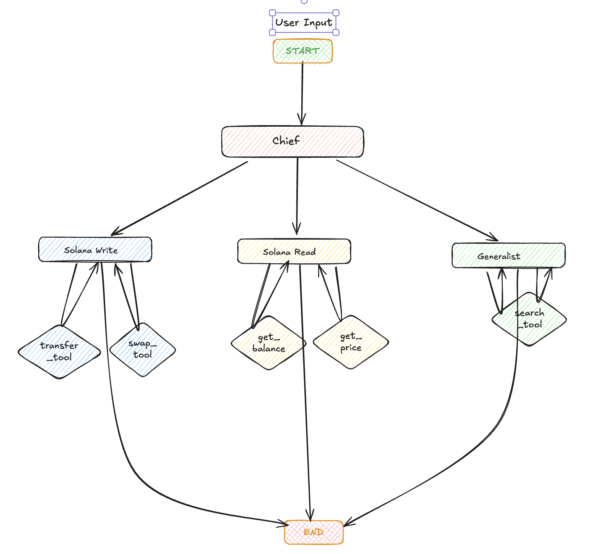

# Agent Kit LangGraph Example

This example demonstrates how to build an advanced Solana agent using LangGraph and the Solana Agent Kit. It showcases a multi-agent system that can handle various Solana-related tasks through a directed workflow.



## Features

- Multi-agent architecture using LangGraph's StateGraph
- Specialized agents for different tasks:
  - General purpose agent for basic queries (with optional Tavily search integration)
  - Transfer/Swap agent for transaction operations
  - Read agent for blockchain data queries
  - Manager agent for routing and orchestration
- Environment-based configuration
- TypeScript implementation with full type safety

## Prerequisites

- Node.js (v16 or higher)
- pnpm package manager
- Solana development environment

## Installation

1. Clone the repository and navigate to the example directory:
```bash
cd examples/agent-kit-langgraph
```

2. Install dependencies:
```bash
pnpm install
```

3. Configure environment variables:
```bash
cp .env.example .env
```

Edit the `.env` file with your configuration:
- Add your OpenAI API key
- Add your Tavily API key (optional, enables web search capabilities)
- Configure any other required environment variables

## Project Structure

```
src/
├── agents/         # Individual agent implementations
├── helper/         # Helper utilities and examples
├── prompts/        # Agent prompts and templates
├── tools/          # Custom tools for agents
└── utils/          # Utility functions and configurations
```

## Usage

To run the example:

```bash
pnpm dev src/index.ts
```

The example demonstrates a workflow where:
1. The manager agent receives the initial query
2. Based on the query type, it routes to the appropriate specialized agent:
   - General queries → Generalist Agent
   - Transfer/Swap operations → TransferSwap Agent
   - Blockchain data queries → Read Agent

## Dependencies

- `@langchain/community`: LangChain community tools and utilities
  - Includes Tavily search integration for enhanced query responses
- `@langchain/core`: Core LangChain functionality
- `@langchain/langgraph`: Graph-based agent workflows
- `solana-agent-kit`: Solana Agent Kit for blockchain interactions
- `zod`: Runtime type checking

## Contributing

Contributions are welcome! Please feel free to submit a Pull Request.

## License

ISC License
